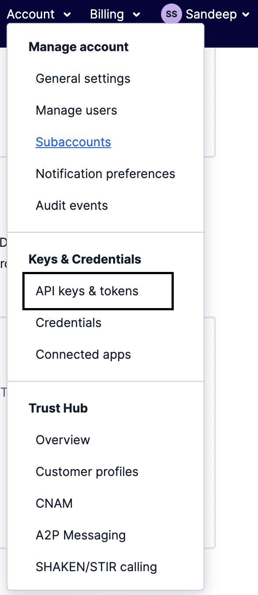
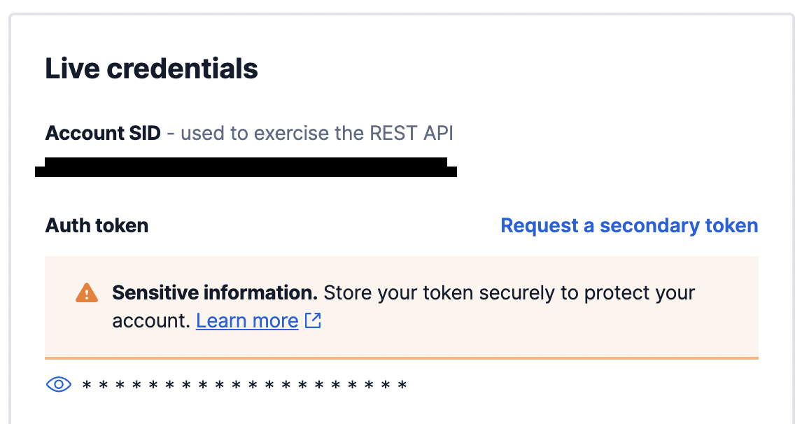

# PostHog Twilio Plugin

## Setting Up Twilio

### Get Account SID & Auth Token

+ Choose Account Option from Top Right Corner.
+ Select `API keys & tokens` from `Keys & Credentials` Section.
  
  

+ Copy your Account SID & Auth Token from `Live credentials` Section.
  
  

### Get Twilio Phone Number

Follow [this](https://www.twilio.com/docs/usage/tutorials/how-to-use-your-free-trial-account#get-your-first-twilio-phone-number) official Documentation to your Twilio Phone Number.

## This plugin will:

+ Trigger SMS on user specified events or actions.
+ You can set time out to avoid frequent messages being sent to the user
+ Minimum Timeout can be 1 sec & Maximum Timeout can be 31536000 secs (i.e 1 Calender Year).
